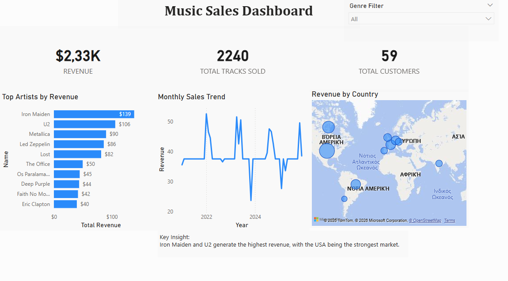

# Chinook Power BI Sales Analysis

Interactive **Power BI dashboard** analyzing music sales using the **Chinook database**.

This project explores music sales performance, identifies top-performing artists, analyzes customer distribution, and visualizes revenue across countries.

---

## Dashboard Preview



---

## Project Overview

This project analyzes sales data from the **Chinook Database**, a sample dataset representing a digital music store.

The dashboard was built using **Power BI** to demonstrate how business intelligence tools can transform raw transactional data into meaningful insights.

---

## Key Metrics

The dashboard tracks the following KPIs:

- **Revenue:** $2.33K
- **Total Tracks Sold:** 2240
- **Total Customers:** 59

---

## Dashboard Features

### Top Artists by Revenue
Displays the artists generating the highest total revenue.

### Monthly Sales Trend
Shows revenue trends over time to identify patterns and changes in sales performance.

### Revenue by Country
Visualizes geographic distribution of revenue across different markets.

### Genre Filter
Interactive filter allowing users to explore sales performance by genre.

---

## DAX Measures

### Revenue

revenue =
SUMX(
    'chinook invoiceline',
    'chinook invoiceline'[UnitPrice] * 'chinook invoiceline'[Quantity]
)

### Total Tracks Sold

Total Tracks Sold =
SUM('chinook invoiceline'[Quantity])

### Total Customers

total customers =
DISTINCTCOUNT('chinook invoice'[CustomerId])

---

## Repository Structure

```
chinook-powerbi-sales-analysis
│
├── README.md
├── LICENSE
│
├── docs
│   └── images
│       └── chinook-dashboard-preview.png
│
├── data
│   └── Chinook.db
│
├── pbix
│   └── chinook-sales-dashboard.pbix
│
└── dax
    └── measures.md
```

---

## Tools Used

- Power BI
- DAX
- SQL / SQLite
- Data Visualization
- Chinook Sample Database

---

## How to Use

1. Download the `.pbix` file from the **pbix** folder
2. Open it using **Power BI Desktop**
3. Connect to the dataset if needed
4. Explore the interactive dashboard and filters

---

## Dataset

This project uses the **Chinook Database**, a sample database designed to simulate a digital music store.

Tables included:

- Invoices
- InvoiceLines
- Artists
- Albums
- Tracks
- Genres

## Business Questions

This dashboard was designed to answer the following business questions:

- Which artists generate the highest revenue?
- How many tracks have been sold in total?
- How does revenue change over time?
- Which countries generate the most sales?
- How many unique customers purchased music?

---

## Key Insights

- **Iron Maiden and U2 generate the highest revenue**, indicating strong demand for classic rock artists.
- The **United States represents the largest market**, contributing the majority of total sales.
- Sales trends show **periodic spikes in revenue**, suggesting seasonal purchasing behavior.
- A relatively small number of artists generate a **large portion of total revenue**, indicating a concentration of sales among top performers.


